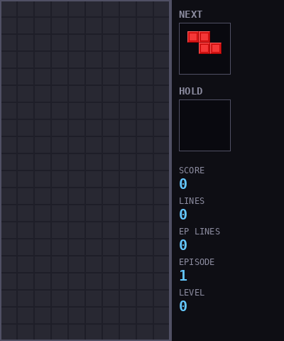

# Tetris AI

A placement-based Tetris agent trained with Dueling Double DQN, action masking, and hold mechanics. The agent learns to play Tetris by choosing where to place each piece (rotation + column) rather than issuing frame-by-frame movement commands.



---

## Key Features

- **Placement-based action space** -- 80 discrete actions (4 rotations x 10 columns x 2 modes: place / hold-then-place)
- **Dueling Double DQN** with BatchNorm CNN backbone
- **Invalid action masking** -- out-of-bounds placements get `-inf` Q-values, so the agent never picks illegal moves
- **Hold mechanic** -- agent can strategically swap the current piece for a held one
- **SRS rotation system** with full wall-kick tables (standard Tetris Guideline)
- **7-bag randomizer** for fair piece distribution
- **Reward shaping** -- line clears, hole penalty, height penalty, bumpiness penalty, clean placement bonus
- **Cosine annealing LR** with warm restarts

---

## Architecture

```
main.py                         CLI entry point (train / play / watch)
    |
src/env.py                      Placement-based RL environment (80 actions)
    |
src/game/tetris.py              Game engine (scoring, gravity, SRS, 7-bag)
src/game/board.py               Board logic (collision, line clearing, metrics)
src/game/pieces.py              Tetromino definitions + SRS kick tables
    |
src/ai/model.py                 Dueling DQN CNN (4ch input -> 80 Q-values)
src/ai/agent.py                 Double DQN agent (action masking, soft target updates)
src/ai/replay_buffer.py         Pre-allocated circular replay buffer
    |
src/train.py                    Training loop (CSV + TensorBoard logging)
src/play.py                     Manual play + AI watch modes (pygame)
src/renderer.py                 Pygame renderer (board, ghost piece, sidebar)
```

### Network Architecture

```
Input: (batch, 4, 20, 10)
  Ch0: Board grid (binary)
  Ch1: Current piece shape
  Ch2: Next piece shape
  Ch3: Held piece shape

  -> Conv2d(4->32, 3x3) + BN + ReLU
  -> Conv2d(32->64, 3x3, stride=(2,1)) + BN + ReLU
  -> Conv2d(64->64, 3x3, stride=(2,1)) + BN + ReLU
  -> Flatten (3200)
  -> Dueling heads:
       Value:     Linear(3200->512) -> ReLU -> Linear(512->1)
       Advantage: Linear(3200->512) -> ReLU -> Linear(512->80)
  -> Q = V + (A - mean(A))

Output: 80 Q-values
```

---

## Quick Start

```bash
git clone https://github.com/Beba-ai-ml/tetris-ai.git
cd tetris-ai
python3 -m venv .venv
source .venv/bin/activate
pip install -r requirements.txt
```

---

## Training

```bash
python3 main.py --mode train --session-id my_run
```

Training runs indefinitely until `Ctrl+C`. Checkpoints and CSV logs are saved to `checkpoints/session_<id>/`. TensorBoard logs go to `runs/session_<id>/`.

Resume from a checkpoint:

```bash
python3 main.py --mode train --session-id my_run --resume checkpoints/session_my_run/best_model.pt
```

Monitor with TensorBoard:

```bash
tensorboard --logdir runs/
```

---

## Watch AI Play

```bash
python3 main.py --mode watch --model checkpoints/session_phase2b/best_model.pt
```

Options:

| Flag | Default | Description |
|------|---------|-------------|
| `--fps` | 30 | Rendering speed |
| `--episodes` | 0 | Number of episodes (0 = infinite) |

---

## Play Manually

```bash
python3 main.py --mode play
```

Controls: Arrow keys to move, Z/X to rotate, Space to hard drop, C to hold.

---

## Project Structure

```
tetris-ai/
  main.py                     Entry point (train / play / watch)
  requirements.txt            Python dependencies
  config/
    hyperparams.yaml           All training hyperparameters
  src/
    env.py                     Placement-based RL environment
    train.py                   Training loop with logging
    play.py                    Manual play + AI watch modes
    renderer.py                Pygame renderer
    game/
      tetris.py                Game engine (scoring, SRS, 7-bag)
      board.py                 Board logic (collision, line clearing)
      pieces.py                Tetromino shapes + SRS kick tables
    ai/
      model.py                 Dueling DQN CNN
      agent.py                 Double DQN agent with action masking
      replay_buffer.py         Circular replay buffer
  scripts/
    record_gif.py              Record demo GIF (PIL-based, no pygame)
  checkpoints/                 Saved models + training CSV logs
  runs/                        TensorBoard logs
  assets/
    demo.gif                   Demo recording
```

---

## How It Works

### Placement-Based Action Space

Instead of per-frame controls (left, right, rotate, drop), the agent makes one decision per piece: **where to place it**. Each action encodes `(rotation, column, hold?)`:

- Actions **0-39**: Place current piece -- `rotation = action // 10`, `column = action % 10`
- Actions **40-79**: Hold first, then place the resulting piece with the same encoding

The piece is instantly hard-dropped to the chosen position. This eliminates the credit assignment problem of multi-step placement.

### Dueling Double DQN with Action Masking

- **Double DQN**: Policy net selects the best action, target net evaluates it -- reduces overestimation bias
- **Dueling architecture**: Separate value and advantage streams -- learns state value independently of action advantages
- **Action masking**: Invalid placements (piece doesn't fit at that rotation+column) are masked to `-inf` before argmax, so the agent only considers legal moves
- **Soft target updates**: Polyak averaging (`tau=0.002`) for stable learning

### Reward Shaping

| Component | Value |
|-----------|-------|
| 1 line clear | +5 |
| 2 lines (double) | +15 |
| 3 lines (triple) | +40 |
| 4 lines (Tetris) | +150 |
| Hole creation | -0.3 per new hole |
| Height increase | -0.03 per row |
| Bumpiness increase | -0.01 per unit |
| Clean placement (0 new holes) | +0.5 |
| Survival bonus (per piece) | +0.1 |
| Game over | -35 |

### Training Pipeline

1. **Warmup**: Collect 1,000 random transitions to fill replay buffer
2. **Epsilon decay**: Linear from 1.0 to 0.01 over 100,000 episodes
3. **Training frequency**: One gradient step every 4 environment steps
4. **Learning rate**: Cosine annealing with warm restarts (cycle = 50,000 episodes)
5. **Batch size**: 256 from a 200,000-transition replay buffer

---

## Configuration

All hyperparameters live in [`config/hyperparams.yaml`](config/hyperparams.yaml):

| Parameter | Value | Description |
|-----------|-------|-------------|
| `board_width` / `board_height` | 10 / 30 | Standard Tetris board (20 visible + 10 buffer) |
| `learning_rate` | 0.00025 | Adam optimizer LR |
| `gamma` | 0.97 | Discount factor |
| `tau` | 0.002 | Soft target update rate |
| `batch_size` | 256 | Training batch size |
| `replay_buffer_size` | 200,000 | Experience replay capacity |
| `epsilon_decay_episodes` | 100,000 | Episodes for epsilon to reach minimum |
| `holes_weight` | 0.3 | Penalty weight for hole creation |
| `game_over_penalty` | 35.0 | Negative reward on death |

---

## Results

After 110,000 episodes of training (Phase 2b):

| Metric | Value |
|--------|-------|
| Avg lines per game (last 1K eps) | 26.3 |
| Median lines per game | 24 |
| Best single game | 100 lines |
| Best reward | 3,009.5 |
| Games with 10+ lines | 87% |
| Games with 20+ lines | 61% |
| Games with 50+ lines | 9% |

---

## License

MIT
